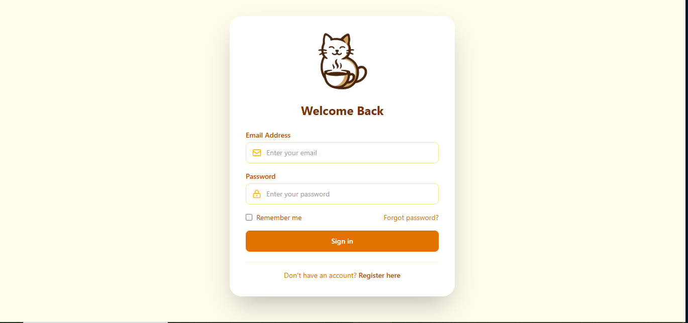
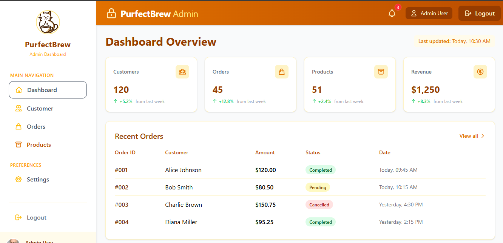
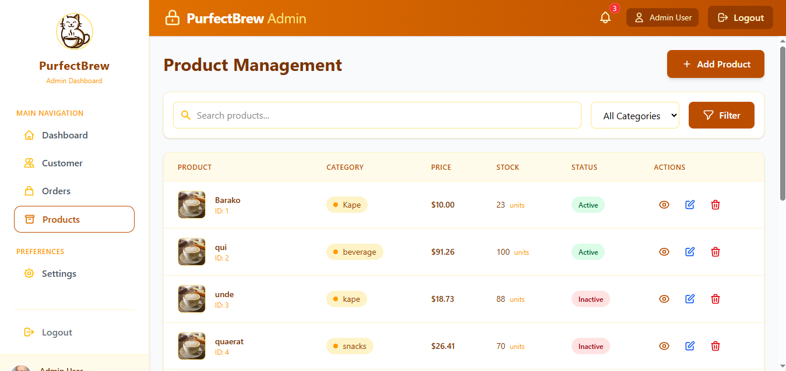

# ☕ Purrfect Brew

A simple coffee shop website with a cat theme. Built with Laravel and TailwindCSS.
It’s built with **Laravel**, **Blade templates**, and styled with **TailwindCSS** for a clean and modern look.  

---
## 🚀 Installation Guide

Follow these steps to set up **Purrfect Brew** on your local machine.

### 1. Clone the repository
```bash
git clone https://github.com/your-username/purrfect-brew.git
cd purrfect-brew
```

### 2. Install dependencies
```bash
composer install
npm install && npm run dev
```

### 3. Generate application key
```bash
php artisan key:generate
```

### 4. Run migrations and seeders
```bash
php artisan migrate --seed
```

### 5. Start the server
```bash
php artisan serve
```

Now open your browser at 👉 [http://localhost:8000](http://localhost:8000)

---

## 📸 Screenshots

### Login


### Admin Dashboard


### Manage Product

